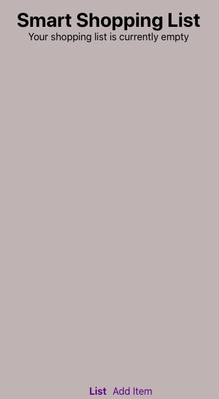

_For an example of how to fill this template out, [see this Pull Request](https://github.com/the-collab-lab/tcl-3-smart-shopping-list/pull/44)._

## Description

<!-- What does this code change? Why did I choose this approach? Did I learn anything worth sharing? Reminder: This will be a publicly facing representation of your work (READ: help you land that sweet dev gig). -->

This pull request contains implementation code for a user of the smart shopping list app to navigate between the "list" view and "add an item" view. In this PR , Dana and I (Edema) created components for these views and clearly delineated them from each other with appropriate routing to navigate to each of these views ("list view" and "add an item view"). We installed react-router-dom dependency and used it for routing. One among the things we learnt in this sprint work was how to collaborate effectively and come up with a working UI.

## Related Issue

<!-- If you write "closes" followed by the Github issue number, it will automatically close the issue for you when the PR merges -->

## Acceptance Criteria

- [x] react-router-dom was added as a project dependency
- [x] Links are present and persistent at the bottom of the app: one for the “list” view, the other for the “add an item” view
- [x] When one of the links is clicked, the browser URL updates to represent the current view and a matching view component is displayed
- [x] Whichever view is selected, the corresponding link is displayed in bold text

<!-- Include AC from the Github issue -->

## Type of Changes

<!-- Put an `✓` for the applicable box: -->

|     | Type                       |
| --- | -------------------------- |
|     | :bug: Bug fix              |
| ✓   | :sparkles: New feature     |
|     | :hammer: Refactoring       |
|     | :100: Add tests            |
| ✓   | :link: Update dependencies |
|     | :scroll: Docs              |

## Updates

### Before

<!-- If UI feature, take provide screenshots -->

### After

<!-- If UI feature, take provide screenshots -->

## Testing Steps / QA Criteria

<!-- Provide steps the other cohort members and mentors need to follow to properly test your additions. -->

- From your terminal, pull down this branch with `git pull origin dc-eu-add-two-views` and check that branch out with `git checkout dc-eu-add-two-views`
- Then `npm update or npm install` to install the newly added dependencies locally and `npm start` to launch the app.
  cypress tests can be added to check for the availability and display of each UI feature and to confirm that appropriate texts and components is displayed on each particular routing. However, tests were not prioritised for this particular implementation stage.
